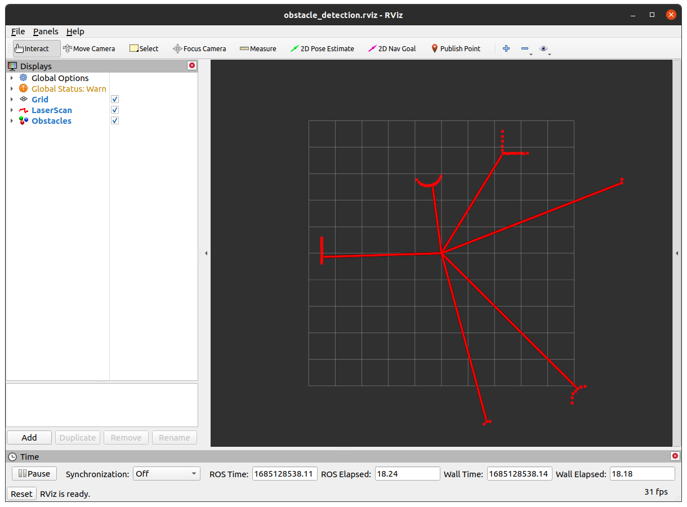

# ROS Obstacle Detection Coding Challenge

## Overview

This repository stores the template code for the Trossen Robotics ROS Obstacle Detection Coding Challenge.
The Challenge is designed to gauge your understanding of ROS topics and ROS nodes, determine if you have a basic understanding of simple algorithms, and test your ability to write clean, documented, readable code.

## Challenge

The goal of this challenge is to write a ROS node that will detect obstacles around the robot based on laser scan data from a bag file.
The bag file contains laser scan data from a static, simulated lidar sensor surrounded by obstacles.
The simulated environment is defined by the [datagen.world](src/gazebo_datagen/worlds/datagen.world) file in the gazebo_datagen package.
Visualizations of the simulated environment are shown below, one in Gazebo, one in RViz.

| Gazebo                   | RViz                    |
| ------------------------ | ----------------------- |
|       |        |


You will edit the [detector_node.cpp](src/obstacle_detection/src/detector_node.cpp) file to implement a ROS node that will analyze incoming ``sensor_msgs::LaserScan`` messages and publish a `visualization_msgs::MarkerArray` message containing arrows pointing to the closest point of each detected obstacle.

The end result should display something like the image below in RViz.



## Docker Setup (Optional)

Ideally, you would be using a computer running Ubuntu 20.04 with ROS Noetic installed.
If not, you can use the Docker container provided in this repository.
Setup instructions for both are provided below.

1.  Install Docker on your computer. You can find instructions [here](https://docs.docker.com/desktop/install/ubuntu/). Note that this may be as easy as running the commands below:

    ```bash
    sudo apt install curl
    curl -sSL https://get.docker.com/ | sh
    sudo usermod -aG docker $(whoami)
    ```

2.  Log out and log back in.

3.  Clone this repository to your computer to the `~/review_ws` directory.

    ```bash
    git clone https://github.com/TrossenRobotics/review_ws.git ~/review_ws
    ```

4.  Build the Docker image.

    ```bash
    cd ~/review_ws
    ./docker_build.sh
    ```

5.  Run the Docker container.

    ```bash
    ./docker_up.sh
    ```

## Tips

See the [sensor_msgs::LaserScan message definition](https://docs.ros.org/en/noetic/api/sensor_msgs/html/msg/LaserScan.html) for details on its implementation.

The simulated lidar sensor has the following definition:

```xml
<sensor name="laser" type="ray">
    <pose>0 0 0 0 0 0</pose>
    <visualize>true</visualize>
    <update_rate>10</update_rate>
    <ray>
        <scan>
            <horizontal>
                <samples>360</samples>
                <min_angle>0</min_angle>
                <max_angle>6.28319</max_angle>
            </horizontal>
        </scan>
        <range>
            <min>0.120</min>
            <max>12</max>
            <resolution>0.015</resolution>
        </range>
        <noise>
            <type>gaussian</type>
            <mean>0.0</mean>
            <stddev>0.01</stddev>
        </noise>
    </ray>
    <plugin name="laser_controller" filename="libgazebo_ros_laser.so">
        <topicName>scan</topicName>
        <frameName>laser_frame</frameName>
    </plugin>
</sensor>
```

